# HOL administration process model

**Status:** current-state observations and proposed-state design for the admin-dashboard change request.
**Audience:** library administrators, library managers, developers, and verifiers.
**Evidence boundary:** the current state is taken from the checked-in frontend and its documented API calls. The proposed state is a product model, not evidence that the API already supplies every capability.

## Purpose and scope

The administrator dashboard must let an authorised library administrator understand the current operational position, move safely to the relevant staff workflow, review the audit trail, and administer privileged staff access when a server-authorised capability is available. It does not make the browser the authority for roles, loans, account status, or audit records.

The model covers dashboard visibility, navigation into operational work, administrator provisioning or role change, audit review, and the failure paths that must remain visible to the operator.

## Current state — observed process

The current dashboard calls `GET /admin/dashboard` for collection counts and independently calls `GET /admin/audit?per_page=8` for recent audit activity. Its cards show titles, copies, members, active loans, and overdue loans; the overdue count links to the staff overdue page. The role-aware navigation shows the dashboard only to a session whose role is `admin`, while the server remains the access-control authority.

The application has separate staff workflows for issuing and receiving copies, managing members, and reviewing overdue loans. The member-registration interface currently posts member identity and category fields to `POST /members`; the checked-in frontend contains no verified endpoint for listing administrators, granting/revoking the `admin` role, or deactivating an administrator. The current dashboard therefore cannot honestly complete those actions.

```mermaid
flowchart TD
    START((" ")) --> SIGNIN["Administrator signs in"]
    SIGNIN --> DASH["Dashboard requests operational counts"]
    DASH --> COUNTS{"Counts request authorised?"}
    COUNTS -->|Yes| AUDIT["Dashboard requests recent audit entries"]
    COUNTS -->|No: session expired or forbidden| REFUSAL["Show server refusal or sign-in state"] --> END1(((" ")))
    AUDIT --> AUDITOK{"Audit request authorised?"}
    AUDITOK -->|Yes| VIEW["Show counts and recent activity"]
    AUDITOK -->|No| PARTIAL["Show counts with audit-access explanation"]
    VIEW --> ROUTE["Administrator opens a staff workflow"]
    PARTIAL --> ROUTE
    ROUTE --> END2(((" ")))

    style START fill:#000,stroke:#000
    style END1 fill:#fff,stroke:#000,stroke-width:3px
    style END2 fill:#fff,stroke:#000,stroke-width:3px
```



### Current-state decision table

| Decision | Verified condition | Current outcome | Gap or consequence |
| --- | --- | --- | --- |
| Dashboard access | Server accepts `GET /admin/dashboard` | Count cards render | Client-side menu visibility is not an access-control decision. |
| Audit access | Server accepts `GET /admin/audit` | Recent activity table renders | Counts survive an audit failure because the calls settle independently. |
| Audit access denied | Audit call rejects | Counts remain with an explanation | The explanation currently says audit is administrator-only, even though the dashboard itself is intended for administrators; the revised interface should present the actual server refusal. |
| Operational intervention | Administrator follows a link to desk, member, or overdue workflow | Existing screen performs the action | Dashboard is a starting point, not the executor of all existing actions. |
| Administrator management | No verified API contract in the repository | No safe action is available | Do not add a client-only promotion, demotion, or invitation flow. |

## Proposed state — administrative control process

The revised dashboard treats operations and access management as separate, auditable capabilities. It loads the operational overview and audit feed in parallel, renders each independently, and offers only actions that are supported by a protected server endpoint. It may show an administrator-management card before that endpoint exists, but the card must name the unavailable capability and link to the approved offline process rather than simulate success.

```mermaid
flowchart TD
    START((" ")) --> AUTH["Authenticate administrator"]
    AUTH --> ROLE{"Server confirms admin role?"}
    ROLE -->|No| DENY["Show access refusal and safe destination"] --> END1(((" ")))
    ROLE -->|Yes| FORK[" "]
    FORK --> OVERVIEW["Load operational overview"]
    FORK --> TRAIL["Load audit activity"]
    OVERVIEW --> JOIN[" "]
    TRAIL --> JOIN
    JOIN --> DISPLAY["Render available modules and their timestamps"]
    DISPLAY --> CHOOSE{"Administrator selects a task"}
    CHOOSE -->|Investigate operations| ROUTE["Open existing staff workflow with context"]
    CHOOSE -->|Review activity| FILTER["Filter or inspect audit records"]
    CHOOSE -->|Manage admin access| CAPABLE{"Protected role-management API available and authorised?"}
    CAPABLE -->|Yes| REQUEST["Submit named access-change request"]
    CAPABLE -->|No| UNAVAILABLE["Explain capability is unavailable; show approved escalation route"]
    REQUEST --> VALID{"Server validates target, authority, and policy?"}
    VALID -->|Yes| RECORD["Server commits change and emits audit event"]
    VALID -->|No| REFUSE["Keep form values where safe; show server reason; write no client-side success"]
    RECORD --> VERIFY["Refresh role roster and audit entry"]
    FILTER --> END2(((" ")))
    ROUTE --> END2
    UNAVAILABLE --> END2
    REFUSE --> END2
    VERIFY --> END2

    style START fill:#000,stroke:#000
    style FORK fill:#000,stroke:#000,height:4px
    style JOIN fill:#000,stroke:#000,height:4px
    style END1 fill:#fff,stroke:#000,stroke-width:3px
    style END2 fill:#fff,stroke:#000,stroke-width:3px
```



The overview and audit requests form a real concurrent fork: neither result should wait for the other. A failed module is presented as unavailable with its server-provided reason, while unaffected authorised modules remain usable.

## Roles and handoffs

| Role or system | Responsibility | Handoff | Confirmation |
| --- | --- | --- | --- |
| Administrator | Reviews service health, initiates permitted administrative actions, and investigates anomalies | Selects an operational or access-management task | Visible task context and confirmation state |
| Dashboard frontend | Displays truthful server state, preserves safe input, and routes to dedicated workflows | Sends authenticated request to API; hands context to staff page | HTTP response is rendered; no local success state is treated as authority |
| Library API | Authorises each operation, enforces policy, persists accepted changes, and creates audit records | Returns data or a refusal | Status code and response body; subsequent read verifies accepted writes |
| Audit service | Supplies immutable activity entries to authorised readers | Provides the recorded event after a committed action | Dashboard refresh displays event timestamp, actor, action, and target |
| Library manager or designated approver | Resolves exceptions when a capability is unavailable or policy requires a second approver | Receives a documented access-change request outside the app | Approved protected API action or recorded rejection |

## Control rules

1. The server authorises every read and write. The frontend may hide irrelevant navigation but must not infer or grant a role.
2. Administrator changes require an explicit target identity, requested role/state, acting administrator identity supplied by the session, server-side policy validation, and an audit event on success.
3. A user must not be able to remove their own final administrative access. The API must reject self-lockout and any change that would leave no active administrator; the frontend must show that refusal plainly.
4. A role-management write is complete only after a subsequent read shows the new state and the audit trail contains the event. A network timeout after submission is an unknown outcome, not a successful or failed change.
5. Dashboard data is operational and member-related. The interface displays only what the endpoint returns, avoids exporting credentials or temporary passwords, and does not place sensitive fields in URLs.

## Exception paths

| Exception | Detection | Required response | Owner |
| --- | --- | --- | --- |
| Expired or absent session | `401` response or no signed-in user | Show the standard sign-in state; do not retain privileged data in the page | Frontend/API |
| Signed-in non-admin | `403` response | State that the operation requires administrator access and link to a permitted destination | Frontend/API |
| Overview or audit unavailable | Request failure or malformed response | Mark only that module unavailable, retain independent successful modules, and provide retry | Frontend |
| Administrator-management API not supplied | No documented protected endpoint | Do not render a submit action; explain that access changes require the designated approval route | Product owner/library manager |
| Policy rejection | API refuses target role, target state, or actor authority | Show server reason; make no local role or roster change | API/frontend |
| Timeout after access-change submission | Transport failure after request begins | Mark result unknown, disable duplicate submission until a role/audit refresh or manual retry decision | Frontend/API |
| Audit entry missing after accepted write | Refresh does not show a matching record within normal replication time | Keep success separate from audit verification, flag the inconsistency for investigation, and do not fabricate an entry | Library API/audit service |
| Suspected misuse | Administrator observes unexpected access or activity | Preserve identifiers and timestamps, restrict only through authorised server process, and escalate to the library manager | Administrator/library manager |

## Traceability and maintenance

This model constrains future requirements and designs: UI controls must map to a verified endpoint, API refusals must be displayed accurately, and every access-changing path must have a named audit-verification step. If the backend later adds role-management endpoints, update the “current state” section and the workflow definitions before enabling the write controls.

## Handoff

```text
HANDOFF
  from:     process-modeler
  to:       documentarian / conductor
  gate:     continuous
  produced: docs/process-model.md, docs/workflows.md
  open:     Exact protected API contracts and policy for administrator roster, invitation, role change, deactivation, final-admin protection, audit filtering, and approved offline escalation are unverified.
  assumed:  The dashboard may surface unavailable administrator management honestly; the library API remains authoritative for all privileged actions.
  next:     Align requirements, architecture, UI specification, and test plan with these decision and exception paths; resolve the listed API contracts before implementation of role-management writes.
```
